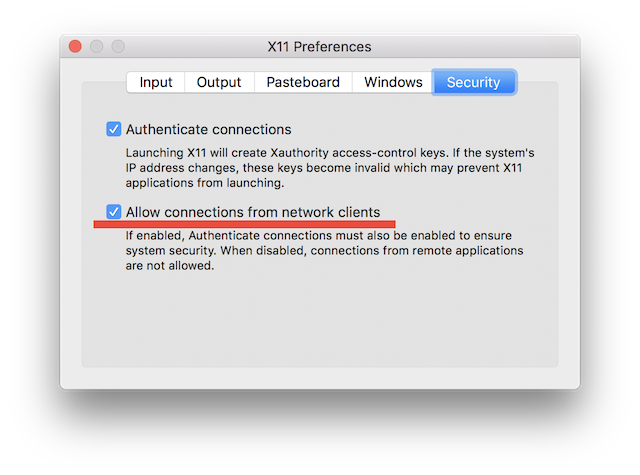

# docker-octave
Docker configuration for [GNU Octave](https://www.gnu.org/software/octave/)

## Build an image from a Dockerfile

```bash
$ git clone https://github.com/msysyamamoto/docker-octave.git
$ cd docker-octave
$ docker build -t octave .
```

## Usage for Mac

Assuming the following:

* macOS Sierra (Version 10.12.3)
* Docker for Mac (v1.13.0 stable)
* [XQuartz](https://www.xquartz.org/) 2.7.11
    * Check `Allow connections from network clients`     

```bash
$ open -a XQuartz
$ ip=$(ifconfig en0 | grep inet | awk '$1=="inet" {print $2}')
$ xhost + $ip
$ docker run --rm -it -e DISPLAY=$ip:0 -v /tmp/.X11-unix:/tmp/.X11-unix octave octave
```

